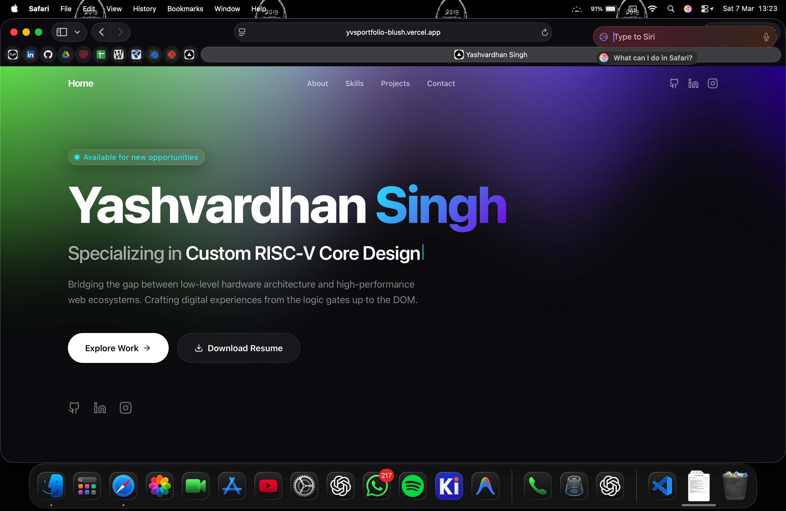

# Yashvardhan Singh | Portfolio

A modern, highly interactive personal portfolio website built to showcase projects, skills, and technical infrastructure expertise. Designed with premium glassmorphism aesthetics, fluid 3D animations, and high performance in mind.

 *(Note: Add a screenshot of your site here in the future)*

## 🚀 Features

- **Next.js 14 App Router**: Leveraging the latest React architectural features.
- **Glassmorphism Design**: Custom UI components featuring sleek, blurred backgrounds and subtle depth.
- **Dynamic 3D Backgrounds**: Integrated WebGL effects (Aurora) providing a continuous, smooth sensory experience.
- **Framer Motion Animations**: Performant scroll-based interactions and unified entry animations.
- **Dark Mode First**: Optimized for high contrast and developer-oriented aesthetics.
- **Fully Responsive**: Flawless layout behavior tailored for desktop, tablet, and mobile viewing.
- **Type-Safe**: Written comprehensively in TypeScript.
- **Built-in Contact Flow**: Pre-configured email and social links (GitHub, LinkedIn, Instagram).

## 🛠️ Tech Stack

- **Framework**: [Next.js](https://nextjs.org/)
- **Frontend library**: [React](https://react.dev/)
- **Styling**: [Tailwind CSS](https://tailwindcss.com/)
- **Animations**: [Framer Motion](https://www.framer.com/motion/)
- **3D Graphics**: [OGL](https://github.com/oframe/ogl)
- **Icons**: [Lucide React](https://lucide.dev/)
- **Language**: [TypeScript](https://www.typescriptlang.org/)

## 💻 Getting Started

### Prerequisites
Make sure you have Node.js 18+ installed on your local machine.

### Installation

1. Clone the repository:
   ```bash
   git clone https://github.com/Vu1can09/Portfoliooo.git
   cd Portfoliooo
   ```

2. Install dependencies:
   ```bash
   npm install
   ```

3. Run the development server:
   ```bash
   npm run dev
   ```

4. Open [http://localhost:3000](http://localhost:3000) in your browser to see the result.

## 📁 Project Structure

```
├── src/
│   ├── app/                # Next.js App Router pages and layouts
│   ├── components/
│   │   ├── 3d/             # WebGL / OGL background components
│   │   ├── features/       # Core page sections (Hero, About, Projects, Contact)
│   │   └── layout/         # Reusable structural components (Navigation, Container)
│   ├── hooks/              # Custom React hooks (e.g., useTypewriter)
│   └── lib/                # Utilities and static configurations
└── public/                 # Static assets (Resume, Images)
```

## 🌐 Deployment

This project is optimized for deployment on [Vercel](https://vercel.com/) or any standard Node.js hosting provider. Simply connect this repository to Vercel and it will automatically deploy with zero configuration.

## 🤝 Let's Connect

- **GitHub:** [@Vu1can09](https://github.com/Vu1can09)
- **LinkedIn:** [Yashvardhan Singh](https://linkedin.com/in/vu1can)
- **Instagram:** [@yashvardhan.0912](https://www.instagram.com/yashvardhan.0912)

---
*Built with ❤️ by Yashvardhan*
